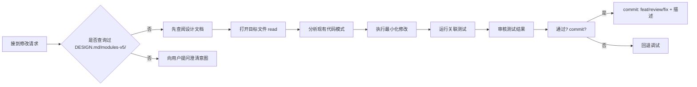

# OriStudio / OriSpark 项目 - Claude Code 交互规范

## 📁 项目文档结构

```
OriSpark/
├── docs/                     # 核心开发文档
│   ├── DESIGN.md             # 系统总纲、版本路线图、模块全景
│   ├── ARCHITECTURE.md       # 五层业务架构 + 六层技术架构
│   ├── UX.md                 # UI 交互设计规范
│   ├── modules-v5/           # 16 个模块详细功能设计
│   └── test-reports/         # 审计自测报告、测试日志
│
├── backend/                  # FastAPI 后端服务
│   ├── app/                  # 应用源代码
│   │   ├── models/           # SQLAlchemy ORM 模型 (40+ 文件, 130+ 类)
│   │   ├── schemas/          # Pydantic 请求/响应模型
│   │   ├── routers/          # API 路由 (35+ 文件, 400+ 端点)
│   │   ├── services/         # 业务逻辑层 (AI/存证/监测/分发...)
│   │   ├── gateway/          # 外部 API 适配器 (Gateway ABC 模式)
│   │   ├── tasks/            # BackgroundTasks + Cron 任务
│   │   └── utils/            # 工具函数
│   ├── alembic/              # 数据库迁移脚本
│   └── tests/                # 单元测试 + 集成测试
│
├── frontend-web/             # Vue 3 Web App (Vite + TS, :5174)
│   ├── src/
│   │   ├── components/       # 通用组件库 (Layout/Table/Form/Modal)
│   │   ├── views/            # 页面视图 (20+ 页面)
│   │   ├── stores/           # Pinia 状态管理
│   │   ├── api/              # Axios API 封装
│   │   ├── composables/      # 组合式函数
│   │   ├── types/            # TypeScript 类型定义
│   │   └── router/           # Vue Router 配置
│
├── frontend-electron/        # Electron 桌面端 (复用 frontend-web)
├── frontend-nuxt/            # Nuxt 3 SSR 宣传门户 (Phase 2)
├── frontend-miniprogram/     # 微信小程序 (Phase 3 远期)
├── design/                   # HTML 高保真原型
├── .archive/                 # 过期文档归档 (历史参考)
├── data/                     # SQLite 数据库开发文件 (.db, .shm, .wal)
├── docker-compose.yml        # Docker 编排配置
└── README.md                 # 项目概览 + 快速启动指引
```

## 🔑 交互规范（Claude 必须遵守）

### 1. 语言规范
- **所有对话和内容必须是中文**。OriStudio 产品面向中国创作者群体，团队内部沟通统一使用中文。
- 任何技术术语保留英文原词时（如 API endpoint、middleware、ORM），均需提供中文释义或注释说明。
- 文档标题、注释、错误信息等多语言字段保持双语对照（English/中文）。

### 2. 设计优先原则
**在开始写任何代码前，必须先查阅官方设计文档：**

| 检查项 | 操作 |
|--------|------|
| 模块定位是否理解？ | 阅读 `docs/modules-v5/<模块名>.md` |
| 架构边界是否清晰？ | 核对 `docs/ARCHITECTURE.md` 的架构图 |
| 接口契约是否一致？ | 查看 `backend/app/schemas/` 中的 Pydantic model |
| 状态流转是否正确？ | 检查 `app/services/<模块>_state_service.py` |

> ⛔ **禁止**在没有查阅 `DESIGN.md` 和 `modules-v5/` 的情况下进行代码修改。

### 3. 代码完整性检查清单（提交前强制）

每个文件修改前请依次执行：

```bash
# Step 1: 查找 TODO/FIXME/⚠️标记
grep -r "TODO\|FIXME\|XXX\|⚠️\|HACK" backend/ app/ --include="*.py"

# Step 2: 查找硬编码敏感值（禁止直接写入密码、token、密钥）
grep -r "sk_" backend/ 2>/dev/null | grep -v ".env" || echo "OK"
grep -r "Authorization:" backend/ 2>/dev/null || echo "OK"

# Step 3: 查找未导入依赖（模块新增必须更新 __init__.py）
python -c "import sys; sys.path.append('backend'); from app import *; print('imports OK')"

# Step 4: 运行相关测试单元
cd backend && pytest tests/test_*.py -v --tb=short
# 目标：≥80% 覆盖率，无新引入的 Fail

# Step 5: 检查数据库迁移是否对齐
cd backend && alembic diff --sql  # 生成迁移脚本需人工审查
```

### 4. 五任务自检框架（交付前强制执行）

每次完整迭代发布前，按以下顺序完成五个任务：

| 步骤 | 任务 | 输出验证 |
|------|------|----------|
| T1 | **代码完整性** - 清除所有 TODO/硬编码/占位符 | `grep -r TODO backend/` 返回空 |
| T2 | **需求对齐** - 对比 v3_final.md 实现范围 | 每有一个功能差异有备注说明 |
| T3 | **多层测试** - unit/integration/exception 测试 | 覆盖≥80%，关键路径 100% 测试 |
| T4 | **文档完备性** - README/依赖/环境变量/DB Schema/API 端点 | `docs/API_Endpoints_List.md` 最新 |
| T5 | **闭环确认** - 签署交付验收声明 | `docs/test-reports/Audit_Report_<version>.md` 签字栏已填写 |

### 5. 文件修改工作流



### 6. 重要约定（禁止违反）

| 禁忌 | 正确做法 |
|------|---------|
| ❌ 直接向生产环境推代码 | ✅ 先在本地/backend 验证后 PR Review |
| ❌ 删除 `.archive/` 中的旧文档 | ✅ 归档保留供历史追溯，禁止删除 |
| ❌ 将 `docs/` 纳入 Git | ✅ `.gitignore` 已排除 docs/，勿添加 |
| ❌ 忽略 `sqlite3-shm/wal` 文件 | ✅ 这些是 SQLite 临时状态文件，不跟踪 |
| ❌ 随意改动 `alembic/versions/` 已提交迁移 | ✅ 新增分支改迁移，原分支保持历史不变 |
| ❌ 忘记更新 `README.md` | ✅ 任何重大变更后同步更新 Readme |

## 🧩 核心技术栈与模式识别

### FastAPI 中间件模式（见 `app/main.py` lifespan）
```python
async def auth_middleware(request: Request, call_next):
    # JWT Token 校验 → inject current_user to request.state
    response = await call_next(request)
    return response
```

### State Machine 模式（`contract_state_service.py`）
```python
class ContractStateTransition:
    VALID_TRANSITIONS = {
        'draft': ['listed', 'cancelled'],
        'listed': ['sold', 'expired'],
        'sold': ['settled']
    }
```

### Gateway ABC 模式（payment_gateway.py 及 avalara_gateway.py）
```python
class PaymentGateway(ABC):
    @abstractmethod
    def process_payment(self, amount: float) -> PaymentResult: pass

class StripeGateway(PaymentGateway): ...
class PayPalGateway(PaymentGateway): ...
```

### 依赖注入模式（routers 中的 `Depends(get_db)`）
```python
@app.post("/api/contracts")
def create_contract(data: CreateContractRequest, db: Session = Depends(get_db)):
    ...
```

## 🛡️ 安全与合规红线

1. **UPL 合规** - 7项免责声明必须在相关流程页面上嵌入（特别是 IP登记、维权、合同签署场景）
2. **CNIPA 律师审核** - 注册流程中不可绕过强制审核步骤
3. **数据主权** - 原始创作文件绝不上传，仅本地存储哈希值
4. **鉴权要求** - 所有 `/api/*` 端点必须携带 `Authorization: Bearer <token>` header

## 🤝 与 Claude 交互的期望

当你看到我在本仓库中提问或执行命令时，请注意：

1. **上下文感知** - 我知道你正在处理 OriStudio 的代码，请直接告诉我问题，无需重复项目背景说明。我已经理解了项目的完整上下文（从初始的五任务自检审计到当前的开发状态）。

2. **遵循上述规范** - 当你对文件进行修改时，请先确认你已查阅了 `DESIGN.md` 和相关模块设计，并在 commit 消息中使用规范的格式（feat/review/fix/etc.）。

3. **测试驱动** - 在进行任何改动前，我建议你先运行相关测试以确保你的修改不会破坏现有功能。

4. **代码审查** - 当你提交了重要的修改后，我可能会要求进行额外的审查，或者建议你使用 `git diff` 来查看具体的更改内容。

5. **环境一致性** - 请确保你在本地环境中能够成功构建和运行项目，特别是在涉及后端 API 和前端集成的修改方面。

---

*本规范于 2026-07-27 更新，与 OriStudio v5.0 项目交付审计保持一致。*